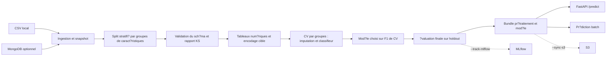

# Network Security ? d?monstration MLOps

Pipeline de classification ? partir de **30 caract?ristiques num?riques de sites web** :
ingestion CSV ou MongoDB, validation du sch?ma, s?lection de mod?les, ?valuation,
API FastAPI et int?gration continue. L'API re?oit des caract?ristiques d?j? extraites ;
elle ne visite pas des URL et ne calcule pas ces caract?ristiques.

## D?monstration locale

Python 3.13 est la version de r?f?rence des v?rifications. Depuis la racine du projet :

```powershell
python -m venv .venv
.venv\Scripts\Activate.ps1
python -m pip install -r requirements-dev.txt
python main.py --source-csv Network_Data/phisingData.csv
python scripts/make_demo_csv.py
python -m uvicorn app:app --host 127.0.0.1 --port 8000
```

Sous Linux/macOS, activer l'environnement avec `source .venv/bin/activate`.
Ouvrir `http://127.0.0.1:8000/docs`, choisir `POST /predict`, puis charger
`prediction_output/demo.csv`. Le CSV doit contenir exactement les 30 caract?ristiques,
sans `Result`. La r?ponse est un tableau HTML avec une colonne `prediction`. Un exemple pr?t ? charger
est aussi fourni dans `examples/predict.csv`.
`GET /health` indique la disponibilit? du mod?le ; sans entra?nement, la pr?diction
renvoie HTTP 503. Un CSV incompatible renvoie HTTP 422.

```powershell
python -m networksecurity.pipeline.batch_prediction prediction_output/demo.csv prediction_output/predictions.csv
```

Aucun service externe n'est n?cessaire pour cette d?monstration. Les fichiers mod?le
fournis initialement sont remplac?s par l'entra?nement et ne sont pas publi?s dans Git.

## Architecture



L'imputation est ajust?e ? l'int?rieur de chaque pli de validation crois?e. Les mod?les
sont class?s par F1 moyen de CV, sans utiliser le test pour les choisir. Les lignes ayant
les m?mes caract?ristiques restent ensemble dans le split et la CV, m?me si leurs
?tiquettes diff?rent. Le split de test vise environ 20 % des lignes.

## Rep?res dans le code

| Dossier / fichier | Responsabilit? |
|---|---|
| `main.py` | Point d'entr?e unique de l'entra?nement |
| `networksecurity/pipeline/` | Orchestration et pr?diction batch |
| `networksecurity/components/` | Ingestion, validation, pr?paration, s?lection et ?valuation |
| `networksecurity/entity/` | Configurations et contrats des artefacts |
| `networksecurity/constant/training_pipeline/` | Valeurs par d?faut et noms de fichiers |
| `networksecurity/utils/` | S?rialisation, CV, m?triques et bundle d'inf?rence |
| `networksecurity/cloud/` | Synchronisation S3 optionnelle avec erreurs propag?es |
| `app.py`, `templates/` | API et affichage des pr?dictions |
| `data_schema/schema.yaml` | Contrat des colonnes ; graphies originales conserv?es |
| `Network_Data/phisingData.csv` | Donn?es sources fournies avec le projet |
| `scripts/` | G?n?ration du CSV d?mo, ping MongoDB et export du rapport |
| `tests/` | Tests des contrats, de la CV, des doublons et de l'API |
| `.github/workflows/main.yml` | Lint, formatage, tests et construction Docker |

## R?sultats et limites

Le mod?le retenu apr?s s?paration des doublons est **Random Forest** : F1 de test
**0,9593**, pr?cision **0,9584**, rappel **0,9601** pour la classe positive encod?e `1`.

Les r?sultats mesur?s sont dans [docs/results.json](docs/results.json), accompagn?s du
jeu de donn?es et des versions utilis?es. Ils repr?sentent un holdout interne de ce jeu
statique, pas une validation sur des attaques r?centes ou des sites externes.

Le fichier contient 11 055 lignes, dont 5 206 doublons complets, et 64 groupes de
caract?ristiques avec des cibles contradictoires. Le d?coupage par groupes emp?che ces
exemples d'appara?tre simultan?ment en entra?nement et en ?valuation. Leur pond?ration
par multiplicit? reste pr?sente. La provenance et les droits de redistribution du CSV
n'?taient pas document?s dans le projet initial et doivent ?tre confirm?s avant une
r?utilisation ou redistribution du jeu de donn?es. Le d?p?t est public ? la demande
de son propri?taire.

`Result = -1` devient `prediction = 0`, et `Result = 1` reste `prediction = 1`.
Le F1 est calcul? pour la classe positive `1`. Le sens m?tier des classes doit ?tre
confirm? avec la documentation source avant d'interpr?ter un score comme un taux de
phishing d?tect?. Le rapport KS compare train et test : il ne constitue pas un monitoring
de production, et ses p-values non corrig?es sont ? interpr?ter prudemment sur ces
caract?ristiques discr?tes.

## Int?grations optionnelles

Copier `.env.example` vers `.env` et remplir uniquement les variables n?cessaires.
Les secrets restent hors Git. Un ancien jeton pr?sent dans le code initial a ?t? supprim?
avant tout commit et doit ?tre r?voqu? aupr?s du service concern?.

**MongoDB** : installer les d?pendances standard, configurer `MONGO_DB_URL`,
`MONGO_DATABASE` et `MONGO_COLLECTION`, puis :

```powershell
python scripts/check_mongodb.py
python push_data.py --source-csv Network_Data/phisingData.csv
python main.py
```

L'import ajoute les lignes ; le r?p?ter cr?e des doublons. Ces commandes effectuent des
op?rations sur le serveur configur? et ne font pas partie de la d?mo locale.

**MLflow** : `python -m pip install -r requirements-tracking.txt`, configurer le serveur
et l'authentification puis utiliser `--track-mlflow`. Sans cette option, aucun r?sultat
n'est envoy?, m?me si une URI est d?finie. Une erreur de suivi interrompt la publication
locale du nouveau mod?le. Le Model Registry et la promotion automatique ne sont pas
impl?ment?s.

**S3** : installer AWS CLI, configurer son authentification et `TRAINING_BUCKET_NAME`,
puis utiliser `--sync-s3`. Les artefacts sont enregistr?s sous un identifiant de run.
Un transfert ?chou? est signal? ; le mod?le local peut d?j? ?tre disponible.

## Qualit? et conteneur

```powershell
python -m ruff check .
python -m ruff format --check .
python -m pytest -q --basetemp=.pytest_tmp
docker build -t networksecurity:local .
docker run --rm -p 8000:8000 -v "${PWD}/final_model:/app/final_model:ro" networksecurity:local
```

Entra?ner le mod?le avant de le monter dans le conteneur ; l'image n'inclut aucun mod?le
historique ni secret. La CI v?rifie aussi le build Docker. Les plages de d?pendances ne constituent pas un fichier de verrouillage complet ;
les versions de la mesure locale sont consign?es dans le rapport. Le projet n'effectue pas de
d?ploiement AWS automatique : le workflow initial comportait des tests factices et des
param?tres de d?ploiement d'un autre compte. L'API de d?mo n'a pas d'authentification ni
de quotas et n?cessite ces protections avant une exposition publique.

## Pr?parer l'entretien

- [Guide de pr?sentation et questions/r?ponses](docs/ENTRETIEN.md)
- [Description des ?tapes, contrats et d?cisions](docs/ARCHITECTURE.md)
- [V?rifications effectu?es et limites de validation](docs/VALIDATION.md)
- [Progression des commits](docs/PROGRESSION.md)

Le projet initial contient des indices d'une base p?dagogique associ?e ? Krish Naik.
Pr?senter honn?tement cette base, ce que tu as compris et tes contributions r?elles ;
les corrections de cette pr?paration sont r?centes et l'historique n'est pas antidat?.
