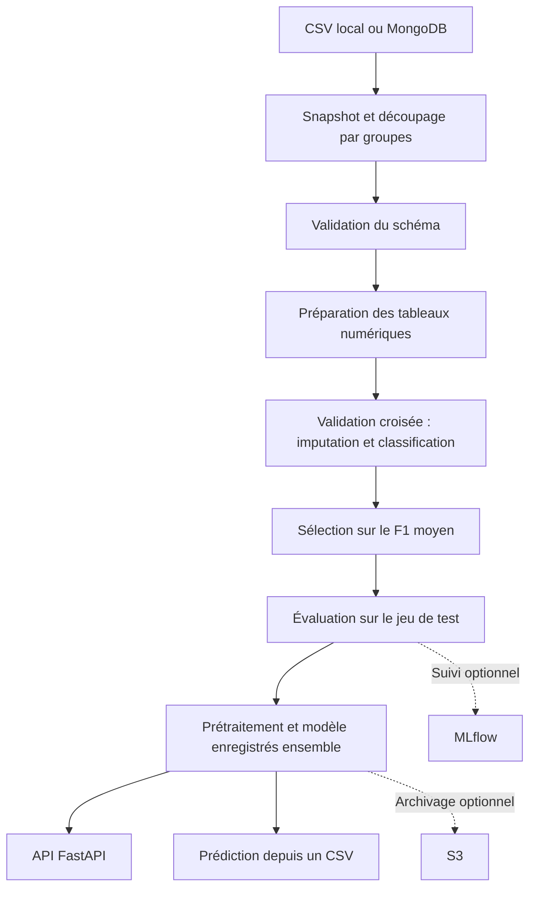

# Network Security

**Classification de sites web : des données brutes à une API de prédiction.**

[](https://github.com/informatikerVonBreuf/networksecurity/actions/workflows/main.yml)


Ce projet rassemble les étapes d’un pipeline MLOps pour la classification de phishing :
charger les données, vérifier leur qualité, comparer plusieurs modèles, puis utiliser le
modèle retenu depuis une API ou un fichier CSV. Il travaille sur **30 caractéristiques
déjà extraites de sites web**. L’extraction de ces caractéristiques à partir d’une URL
reste à développer.

La démonstration fonctionne en local. MongoDB, MLflow et S3 peuvent être ajoutés selon
les besoins.

[Prise en main](#prise-en-main) · [Architecture](docs/ARCHITECTURE.md) · [Résultats](#résultats) · [Guide d’entretien](docs/ENTRETIEN.md)

## Résultats

Le modèle retenu est une **Random Forest**, choisie sur le F1 moyen en validation croisée.

| Validation croisée | F1 sur le test | Précision sur le test | Rappel sur le test |
| :---: | :---: | :---: | :---: |
| **0,9544** | **0,9593** | **0,9584** | **0,9601** |

Ces mesures concernent la classe positive `1` et un jeu de test réservé dans les données
fournies. Les versions des bibliothèques, les métriques détaillées et l’empreinte du CSV
sont disponibles dans [le rapport de résultats](docs/results.json).

Le jeu contient **11 055 lignes**, dont **5 206 doublons complets**. Les lignes ayant les
mêmes caractéristiques restent dans une seule partition, lors du découpage entraînement/test
comme lors de la validation croisée. Cela évite de mesurer le modèle sur des exemples
identiques à ceux qu’il a appris. [Les limites de cette évaluation](docs/VALIDATION.md)
sont documentées.

## Prise en main

Prérequis : **Python 3.13**. Exécuter les commandes depuis la racine du projet.

### 1. Installer l’environnement

Sous Windows, avec PowerShell :

```powershell
python -m venv .venv
.venv\Scripts\Activate.ps1
python -m pip install -r requirements-dev.txt
```

Sous Linux ou macOS, remplacer la commande d’activation par :

```bash
source .venv/bin/activate
```

### 2. Entraîner le modèle

```powershell
python main.py --source-csv Network_Data/phisingData.csv
```

Chaque entraînement conserve ses fichiers dans `Artifacts/<run>/`. Le modèle prêt pour
l’inférence est enregistré dans `final_model/model.pkl`, avec son prétraitement et les
noms des colonnes attendues.

### 3. Essayer l’API

```powershell
python -m uvicorn app:app --host 127.0.0.1 --port 8000
```

Ouvrir [la documentation interactive](http://127.0.0.1:8000/docs), sélectionner
**POST /predict**, puis charger `examples/predict.csv`. La réponse affiche les lignes
du fichier et leur prédiction.

| Route | Utilisation |
| --- | --- |
| `GET /health` | Vérifier que le service répond et qu’un modèle est disponible |
| `POST /predict` | Envoyer un CSV contenant les 30 caractéristiques, sans la colonne `Result` |

Un modèle absent renvoie **503**. Un CSV dont les colonnes ou les valeurs sont incompatibles
renvoie **422**. Les classes sont encodées ainsi : `-1 → 0` et `1 → 1`.
Leur signification métier doit être confirmée avec la documentation source du jeu de données.

### Prédire depuis un fichier

```powershell
python -m networksecurity.pipeline.batch_prediction examples/predict.csv prediction_output/results.csv
```

Pour générer cinq autres exemples à partir du CSV source : `python scripts/make_demo_csv.py`.
Ces exemples servent à montrer le fonctionnement de l’API ; ils ne constituent pas une
évaluation indépendante du modèle.

## Le pipeline



L’imputation est apprise dans chaque pli de validation croisée. Le jeu de test intervient
uniquement après la sélection du modèle. L’API et la commande de prédiction utilisent
le même objet enregistré.

## Organisation du code

| Emplacement | Rôle |
| --- | --- |
| `main.py` | Lancer un entraînement |
| `app.py` et `templates/` | Servir l’API et afficher les résultats |
| `networksecurity/components/` | Ingestion, validation, préparation et entraînement |
| `networksecurity/pipeline/` | Enchaîner les étapes et lancer les prédictions CSV |
| `networksecurity/entity/` | Configurations et objets échangés entre les étapes |
| `networksecurity/utils/` | Sérialisation, comparaison des modèles et métriques |
| `networksecurity/cloud/` | Transférer les artefacts vers S3 |
| `data_schema/` | Définir les colonnes attendues |
| `scripts/` et `tests/` | Préparer la démonstration et vérifier le comportement du code |

Les noms des colonnes et `phisingData.csv` conservent la graphie du fichier source.
Les renommer demanderait de modifier aussi le schéma et les fichiers d’entrée.

## Vérifications et Docker

```powershell
python -m ruff check .
python -m ruff format --check .
python -m pytest -q --basetemp=.pytest_tmp
```

GitHub Actions exécute ces vérifications, puis construit l’image Docker. Pour lancer
l’API dans un conteneur, entraîner d’abord le modèle en local :

```powershell
docker build -t networksecurity:local .
docker run --rm -p 8000:8000 -v "${PWD}/final_model:/app/final_model:ro" networksecurity:local
```

La commande de montage ci-dessus est prévue pour PowerShell. Les modèles et les secrets
ne sont pas inclus dans l’image.

## Pour aller plus loin

- [Présentation complète : contexte, actions et résultats](docs/PRESENTATION_COMPLETE.md)
- [Version pour LinkedIn](docs/LINKEDIN.md)
- [Intégrations MongoDB, MLflow et S3](docs/INTEGRATIONS.md)
- [Choix techniques et contrats entre les étapes](docs/ARCHITECTURE.md)
- [Vérifications réalisées et limites connues](docs/VALIDATION.md)
- [Présentation en entretien et questions fréquentes](docs/ENTRETIEN.md)
- [Historique des étapes du projet](docs/PROGRESSION.md)

Le projet s’appuie sur une base pédagogique associée à Krish Naik. La provenance et les
droits de redistribution du CSV restent à préciser. Le déploiement automatisé, le suivi
en production et la gestion d’un registre de modèles sont les prochaines étapes.
