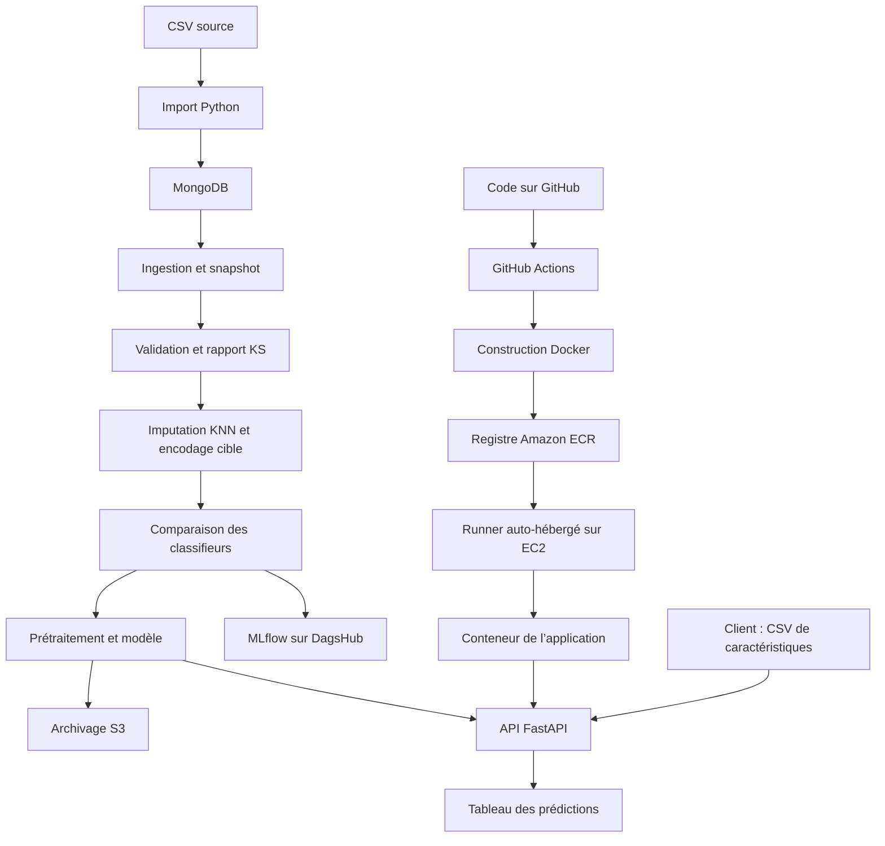

# Network Security : de l’apprentissage MLOps au déploiement sur AWS

## Contexte

Ce projet s’inscrit dans mon apprentissage d’AWS et dans la mise en pratique de mes
formations Google Cloud sur le MLOps, l’évaluation des modèles et la sécurité des systèmes
d’IA. Mon objectif était de comprendre le parcours complet d’un modèle : partir d’un jeu
de données, construire un entraînement organisé, conserver les résultats, exposer une
prédiction et déployer l’application dans le cloud.

Le cas étudié est la classification de sites web à partir de 30 caractéristiques
numériques : propriétés des URL, signaux liés au domaine, au certificat SSL, aux liens
et au comportement des pages. Le fichier fourni contient 11 055 observations et une
colonne cible, `Result`, encodée avec les valeurs `-1` et `1`.

Le projet reprend une base pédagogique associée à Krish Naik. Il sert à mettre en pratique
une architecture de traitement, les intégrations de suivi et de stockage, ainsi que
la distribution d’une application par conteneur. Il ne comporte pas d’extraction
automatique de caractéristiques depuis une URL.

### Lien avec les formations Google Cloud

La capture des acquis présente six badges de fin de formation :

| Formation | Date indiquée |
| --- | --- |
| Machine Learning Operations (MLOps) with Agent Platform: Model Evaluation | 7 octobre 2026 |
| Machine Learning Operations (MLOps): Getting Started | 9 août 2026 |
| Machine Learning Operations (MLOps) for Generative AI | 20 février 2026 |
| Model Armor: Securing AI Deployments | 12 août 2026 |
| Google Cloud Agent Governance and Security | 12 août 2026 |
| Secure Enterprise AI Agents | 11 août 2026 |

Les formations MLOps donnent un cadre à la séparation des étapes, à l’évaluation et à
la traçabilité. Les formations de sécurité et de gouvernance complètent la réflexion sur
les accès, les secrets et la mise à disposition d’un système d’IA.

Ce projet est une application de classification tabulaire déployée sur AWS. Il n’implémente
pas un agent, un modèle génératif ou Google Model Armor. Les badges de la capture sont
présentés comme des acquis de formation ; ils ne constituent pas, à eux seuls, la preuve
d’une certification professionnelle Google Cloud obtenue par examen.

## Périmètre et preuves

La présentation reconstitue l’architecture initiale à partir des fichiers lus lors du
premier examen du projet. Ce dossier n’avait pas d’historique Git ; les commits du dépôt
actuel commencent avec sa préparation récente.

Le propriétaire confirme que l’image ECR et l’API sur EC2 ont fonctionné lors de son
déploiement initial. Cette confirmation est distincte des vérifications de la préparation
actuelle, qui portent sur l’entraînement local, l’API, les tests et la CI.

| Élément | Statut |
| --- | --- |
| MongoDB, MLflow/DagsHub, S3, FastAPI et Docker | Présents dans le code initial |
| Construction et publication ECR, exécution sur EC2 | Fonctionnement confirmé par le propriétaire |
| Derniers tests, construction Docker en CI et métriques | Vérifiés pendant la préparation actuelle |
| Nouvelle exécution AWS depuis la version actuelle | Non effectuée |
| Connexions récentes aux services MongoDB, MLflow et S3 | Non vérifiées pendant la préparation actuelle |

## Actions : le parcours de bout en bout

### 1. Organiser le projet en composants

**Besoin.** Éviter un entraînement entièrement concentré dans un script et rendre les
étapes compréhensibles.

**Réalisation.** Le code initial sépare quatre composants : ingestion, validation,
transformation et entraînement. Les classes de configuration définissent leurs paramètres
et leurs chemins de sortie. Des dataclasses transmettent les fichiers et les métriques
entre les étapes. Des modules communs gèrent la sérialisation, les exceptions et les logs.

`TrainingPipeline` enchaîne les étapes et déclenche ensuite les transferts S3. Le
`main.py` initial répète une partie de cette orchestration au lieu d’appeler uniquement
le pipeline ; cette duplication a été supprimée dans la préparation récente.

**Résultat.** Une organisation par responsabilités et des artefacts intermédiaires
qui permettent de suivre le passage des données jusqu’au modèle.

### 2. Importer le CSV dans MongoDB

**Besoin.** Disposer d’une source persistante pour le pipeline, séparée du script
d’entraînement.

**Réalisation.** `push_data.py` lit `Network_Data/phisingData.csv` avec pandas,
transforme les lignes en documents JSON et les insère dans une collection via
`pymongo.MongoClient` et `insert_many`. Le code initial utilise une base et une
collection définies dans ses constantes.

**Résultat.** Le pipeline peut lire les observations depuis MongoDB. L’import initial
est un ajout de documents, sans mécanisme d’upsert ou de déduplication : le relancer peut
ajouter plusieurs fois les mêmes lignes. La présence de doublons dans le fichier ne prouve
toutefois pas qu’ils ont été créés par un import répété.

### 3. Extraire les données et réserver un jeu de test

**Besoin.** Produire une copie des données utilisées et préparer une évaluation.

**Réalisation initiale.** `DataIngestion` lit les documents de la collection, les
convertit en DataFrame, retire `_id`, remplace `na` par `NaN` et enregistre un CSV
dans le répertoire de feature store. `train_test_split` réserve 20 % des lignes pour
le test et écrit les deux partitions.

Le « feature store » de ce projet est un dossier de fichiers, pas un service de
feature store avec catalogue, accès en ligne et gestion des versions.

**Résultat.** Un snapshot et deux fichiers d’entrée pour les étapes suivantes. Le
découpage initial n’était ni groupé ni fixé par une graine ; la préparation récente
a renforcé sa reproductibilité et sa gestion des doublons.

### 4. Contrôler le schéma et comparer les distributions

**Besoin.** Vérifier que les données correspondent aux entrées attendues avant
l’apprentissage.

**Réalisation initiale.** Un schéma YAML décrit les 30 caractéristiques et la cible.
`DataValidation` est conçu pour contrôler les colonnes, puis appliquer
`ks_2samp` aux distributions entraînement/test. Un rapport YAML enregistre les
p-values et un indicateur de différence de distribution au seuil de 0,05.

**Résultat visé.** Des fichiers validés et un rapport permettant d’examiner les
différences entre partitions.

**Correction récente.** Le contrôle initial comptait les clés principales du YAML
au lieu des colonnes. La fonction de rapport ne renvoyait pas son statut, et les copies
validées n’étaient pas les chemins réellement transmis. Ces points ont été corrigés :
le pipeline vérifie désormais les noms exacts, les valeurs numériques, les infinis,
les cibles et les caractéristiques entièrement manquantes.

Le rapport KS reste un diagnostic train/test. Il ne constitue pas un monitoring de
production et ne mesure pas une dérive observée dans le temps.

### 5. Préparer les caractéristiques et la cible

**Besoin.** Construire des entrées compatibles avec les classifieurs et appliquer
le même traitement à la prédiction.

**Réalisation initiale.** `DataTransformation` sépare la cible des caractéristiques,
encode `-1` en `0` et utilise un `KNNImputer` avec trois voisins et des poids
uniformes. L’imputer est ajusté sur l’entraînement, puis appliqué aux deux partitions.
Les tableaux sont sauvegardés en NumPy et le prétraitement au format pickle, notamment
dans `final_model/preprocessor.pkl`.

**Résultat.** Des tableaux utilisables par l’entraînement et un prétraitement réutilisable
à l’inférence.

**Correction récente.** Le code initial évitait d’ajuster l’imputer sur le test, mais le
prétraitement était appris avant la validation croisée. Il pouvait donc utiliser des
informations des futurs plis de validation. Le prétraitement est maintenant inclus dans
chaque pipeline candidat et ajusté dans chaque pli.

### 6. Comparer les modèles

**Besoin.** Choisir un classifieur à partir de plusieurs familles et de plusieurs
paramètres.

**Réalisation initiale.** Le projet compare Random Forest, arbre de décision,
Gradient Boosting, régression logistique et AdaBoost. `GridSearchCV` explore les
hyperparamètres avec trois plis. Le code ajuste ensuite les modèles avec les paramètres
retenus et compare leurs prédictions.

La grille initiale était plus large que celle de la démonstration actuelle :

| Modèle | Paramètres explorés dans la première version |
| --- | --- |
| Random Forest | `n_estimators` : 8, 16, 32, 128, 256 |
| Arbre de décision | `criterion` : gini, entropy, log_loss |
| Gradient Boosting | Quatre learning rates, cinq valeurs de subsample et six nombres d’estimateurs |
| Régression logistique | Paramètres par défaut, sans grille spécifique |
| AdaBoost | Trois learning rates et six nombres d’estimateurs |

Une configuration est ajustée sur les plis d’entraînement et évaluée sur les plis de
validation. La recherche explore donc plusieurs apprentissages par candidat, pas un
simple entraînement unique.

**Limite de la première version.** La recherche utilisait le score par défaut des
classifieurs, tandis que le classement final utilisait R² sur le jeu de test. R² est une
métrique de régression ; utiliser le test pour choisir le meilleur modèle compromet aussi
son rôle d’évaluation indépendante.

**Correction récente.** Les candidats sont classés sur le F1 moyen de validation croisée,
avec un seuil minimal de 0,6. Le test n’intervient qu’après la sélection. La grille récente
contient deux configurations par famille, pour garder une exécution courte et lisible.

### 7. Mesurer les performances et conserver les expériences

**Besoin.** Relier un modèle à ses résultats et conserver une trace des essais.

**Réalisation initiale.** Le projet calcule F1, précision et rappel sur l’entraînement et
le test. L’intégration MLflow pointe vers un serveur de suivi hébergé sur DagsHub et
journalise des métriques ainsi que des modèles scikit-learn.

MLflow sert au suivi des expériences ; DagsHub héberge le service de suivi utilisé
par cette configuration. Cela ne correspond pas à un déploiement du modèle dans
Google Cloud.

**Points repris.** L’ancienne configuration contenait une URI, un nom de compte et un
jeton codés en dur. Elle répétait des appels de journalisation et tentait un enregistrement
avec un nom de modèle mal formé. La configuration est maintenant externe et le suivi
se lance avec `--track-mlflow`. La version récente écrit les métriques train/test dans
un seul run lorsqu’il est activé.

**Résultat.** Une intégration de traçabilité prévue pour comparer les entraînements.
Le registre de modèles, les étapes de promotion et la validation d’un serveur réel
ne sont pas démontrés par les vérifications récentes.

### 8. Enregistrer le modèle et archiver les artefacts sur S3

**Besoin.** Réutiliser les sorties du pipeline et conserver une copie distante.

**Réalisation initiale.** Le pipeline écrit les partitions, les tableaux transformés,
le prétraitement, le modèle et le rapport de distribution dans un dossier horodaté.
Après l’entraînement, `TrainingPipeline` synchronise les artefacts et le modèle final
vers un bucket S3 avec `aws s3 sync`.

**Résultat.** Un archivage des fichiers d’entraînement. S3 ne remplace ni MongoDB,
ni le serveur MLflow, ni le registre d’images ECR.

**Points repris.** Le bucket initial était codé en dur. Le transfert utilisait
`os.system` sans vérifier son résultat. La version actuelle lit
`TRAINING_BUCKET_NAME`, utilise une liste d’arguments avec `subprocess.run(check=True)`
et demande une option explicite `--sync-s3`.

Le chemin de sauvegarde du modèle initial comportait aussi une incohérence :
le code enregistrait la classe `NetworkModel` dans un artefact au lieu de l’instance
ajustée. La version actuelle enregistre un objet complet contenant le prétraitement,
le classifieur et les noms des colonnes.

### 9. Exposer le modèle avec FastAPI

**Besoin.** Transformer le modèle enregistré en une application utilisable.

**Réalisation initiale.**

- La route `/` redirige vers `/docs`.
- `GET /train` lance le pipeline d’entraînement.
- `POST /predict` reçoit un fichier CSV, lit ses lignes avec pandas et charge le
  prétraitement et le classifieur depuis deux fichiers.
- `NetworkModel.predict` transforme les entrées, puis applique le classifieur.
- La réponse HTML affiche le CSV avec une colonne de prédiction.
- Un fichier de sortie est écrit dans `prediction_output/`.

**Résultat.** Une interface HTTP pour l’entraînement et la prédiction. La requête de
prédiction attend des caractéristiques déjà calculées, pas une simple URL.

**Évolution récente.** L’entraînement se lance par commande, l’API charge un modèle
complet et vérifie les colonnes. `GET /health` indique sa disponibilité. Le tableau
de résultats a été revu pour rester lisible sur un petit écran. La démonstration n’a
pas encore d’authentification ou de quotas d’upload.

### 10. Construire l’image Docker

**Besoin.** Exécuter l’application avec ses dépendances sur une autre machine.

**Réalisation initiale.** Le Dockerfile part de `python:3.10-slim-buster`, crée
`/app`, copie le projet, installe AWS CLI et les dépendances Python, puis lance
`python3 app.py`. L’application Uvicorn écoute sur `0.0.0.0:8000`.

**Résultat.** Une image qui contient l’application et son environnement Python.
Un modèle doit également être disponible pour que la prédiction fonctionne :
la première image pouvait embarquer les fichiers déjà présents dans le dossier copié,
mais la construction ne déclenchait pas d’entraînement et ne récupérait pas automatiquement
un modèle depuis S3.

La version actuelle exclut les secrets et les modèles générés du contexte Docker.
Le modèle est fourni séparément, par exemple par montage du dossier `final_model/`.

### 11. Publier l’image dans Amazon ECR

**Besoin.** Mettre l’image Docker à disposition du serveur de déploiement.

**Réalisation initiale.** Le workflow GitHub Actions se déclenche sur les pushes
vers `main`, sauf ceux concernant uniquement le README. Son job de livraison :

1. récupère le code ;
2. configure l’accès AWS avec des secrets GitHub ;
3. s’authentifie au registre ECR ;
4. construit l’image ;
5. la tague avec l’adresse du registre, le nom du repository et `latest` ;
6. la publie avec `docker push`.

Les variables attendues incluent `AWS_ACCESS_KEY_ID`, `AWS_SECRET_ACCESS_KEY`,
`AWS_REGION` et `ECR_REPOSITORY_NAME`. Le README initial cite la région
`us-east-1` et des identifiants liés à un autre compte ; ces valeurs ne sont pas
reprises ici.

**Résultat.** Une image disponible dans ECR. Le fonctionnement de cette publication
est confirmé par le propriétaire pour son déploiement initial.

ECR stocke des images de conteneur, pas des runs MLflow. Le tag `latest` désigne
une version mouvante ; un tag de commit et un digest permettent de mieux identifier
une version livrée. [Documentation AWS](https://docs.aws.amazon.com/AmazonECR/latest/userguide/docker-push-ecr-image.html)

### 12. Exécuter le conteneur sur EC2

**Besoin.** Disposer d’une machine qui héberge l’API.

**Réalisation prévue par les fichiers initiaux.** Le README décrit l’installation
de Docker sur une machine Ubuntu EC2 et l’ajout de l’utilisateur `ubuntu` au groupe
Docker. Le job de déploiement s’exécute avec `runs-on: self-hosted`.

Dans l’architecture visée, un runner GitHub Actions installé sur EC2 exécute les
commandes du job directement sur cette instance. Le workflow n’utilise pas de connexion
SSH explicite et ne comporte pas de tâche ECS. Un commentaire évoquait ECS, mais les
commandes présentes lancent un conteneur Docker sur la machine du runner.

Le job configure AWS, se connecte à ECR, télécharge l’image avec `docker pull`,
puis exécute `docker run -d` sous le nom `networksecurity`. Les variables AWS sont
passées au conteneur pour les opérations cloud prévues par l’application.

**Résultat confirmé.** Le propriétaire indique que l’API a été accessible sur EC2
dans son déploiement initial. Les journaux de ce déploiement et son URL ne figurent
pas parmi les preuves vérifiées pendant la préparation récente.

L’exécution d’un runner auto-hébergé exige aussi de gérer sa machine et ses logiciels.
[Documentation GitHub](https://docs.github.com/en/actions/concepts/runners/self-hosted-runners)

### 13. Comprendre le trajet d’une requête

Quand l’application est déployée, le client contacte l’adresse du serveur et le
port publié. Le trafic doit être autorisé par le groupe de sécurité EC2 et les autres
éléments réseau utilisés.

Docker transmet la requête du port de l’hôte vers le port du conteneur. Uvicorn reçoit
la requête et FastAPI choisit la route. Pour `/predict`, le CSV est chargé, les
caractéristiques sont transformées, le modèle prédit, puis la réponse HTML revient
au client.

Le YAML initial affiche `-p 8080:8080`, alors que l’application écoute sur 8000.
Ces valeurs seules ne permettent pas de joindre l’application comme prévu.
Une configuration cohérente serait, par exemple, `8080:8000` : le client appelle
le port 8080 de l’instance et Docker le transmet au port 8000 du conteneur.

Cette incohérence concerne les fichiers transmis. Elle ne remet pas en cause le
déploiement fonctionnel confirmé par le propriétaire : sa configuration exécutée
a pu comporter des ajustements qui ne figurent pas dans ces fichiers.
Les règles réseau nécessaires ne sont pas définies dans le repository.
[Groupes de sécurité EC2](https://docs.aws.amazon.com/AWSEC2/latest/UserGuide/ec2-security-groups.html)

### Conditions nécessaires au déploiement

Le code décrit la livraison, mais ne crée pas à lui seul l’infrastructure AWS.
Le parcours comporte aussi la préparation d’un repository ECR, d’une instance EC2,
de ses accès IAM et de ses règles réseau. L’instance doit avoir Docker et le runner
GitHub Actions installés, pouvoir contacter GitHub et ECR, puis disposer des fichiers
modèle nécessaires à l’application.

Les autorisations AWS doivent couvrir les opérations utilisées : publication de l’image
pour la livraison, téléchargement pour le serveur et accès aux objets S3 si le conteneur
archive des entraînements. Les politiques exactes et les règles appliquées au compte
ne sont pas présentes dans le dossier fourni.

L’adresse d’une image suit la forme :

```text
<compte>.dkr.ecr.<region>.amazonaws.com/<repository>:<tag>
```

Le registre, le nom du repository et le tag sont des éléments distincts. Une variable
contenant déjà le chemin du repository ne doit pas recevoir une seconde fois ce nom :
les exemples du README initial et la construction de l’URI dans le job de déploiement
demandaient cette vérification.

## Architecture initiale



Le graphique rassemble deux parcours : l’entraînement produit le modèle et la
livraison distribue l’application. Le workflow initial ne lançait pas automatiquement
un nouvel entraînement avant chaque construction d’image.

## Lecture du CI/CD initial

| Étape | Ce que le fichier faisait | Ce qui manquait ou demandait une correction |
| --- | --- | --- |
| Intégration | Affichait des messages de lint et de tests | Aucun véritable lint ni test automatisé |
| Livraison ECR | Construisait et poussait l’image `latest` | Version immuable et contrôle du modèle embarqué |
| Déploiement | Téléchargeait et lançait l’image sur le runner | Cohérence des ports et gestion du conteneur précédent |
| Nettoyage | Exécutait `docker system prune -f` | Ce nettoyage ne remplaçait pas un redéploiement contrôlé |

Le bloc d’arrêt de l’ancien conteneur était commenté. Le relancement pouvait donc
échouer si le nom `networksecurity` était déjà utilisé. Aucune vérification de santé
après déploiement, procédure de retour arrière, configuration HTTPS ou supervision
continue n’était définie dans le workflow.

Le workflow demandait une permission `id-token: write`, mais sa configuration AWS
utilisait des clés d’accès ; cela ne suffit pas à démontrer une authentification OIDC.
La configuration IAM, les règles réseau et l’installation du runner n’étaient pas
automatisées par Terraform ou CloudFormation dans les fichiers fournis.

La CI récente remplace les messages factices par Ruff, huit tests et une construction
Docker vérifiée. Elle ne relance pas le déploiement AWS historique.

## Résultats

### Ce que le projet initial a permis de mettre en pratique

Le projet réunit une source de données MongoDB, un entraînement scikit-learn organisé,
un suivi MLflow, un archivage S3, une API FastAPI et une distribution Docker.
Le déploiement initial a abouti à une image publiée dans ECR et à une API accessible
sur EC2, d’après la confirmation du propriétaire.

Ce parcours permet de comprendre la différence entre entraîner un modèle, enregistrer
ses artefacts, construire l’application et livrer un conteneur sur une infrastructure.

### Résultats vérifiés après la préparation récente

| Indicateur | Résultat |
| --- | ---: |
| Modèle retenu | Random Forest |
| F1 moyen de validation croisée | 0,9544 |
| F1 sur le test | 0,9593 |
| Précision sur le test | 0,9584 |
| Rappel sur le test | 0,9601 |
| Lignes d’entraînement | 8 898 |
| Lignes de test | 2 157 |
| Groupes communs aux deux partitions | 0 |
| Tests automatisés | 8 réussis |
| CI et construction Docker | Réussies |

Ces métriques sont celles de la version corrigée, pas une mesure reconstituée du
premier déploiement. Le regroupement des doublons et l’apprentissage du prétraitement
dans les plis rendent l’évaluation plus solide, sans remplacer un test externe ou temporel.

### Bilan d’apprentissage

Ce travail relie les notions étudiées en MLOps à une application et à ses contraintes
de déploiement : dépendances, cohérence du prétraitement, secrets, versions, accès au
registre et disponibilité du modèle dans le conteneur.

Il permet aussi d’identifier ce qui sépare une démonstration d’un service exploité :
une CI qui teste réellement, une image et un modèle versionnés, des accès maîtrisés,
une vérification après déploiement, un suivi en production et une procédure de retour
à une version précédente.

## Version orale : contexte, actions, résultats

**Contexte.** « J’ai travaillé sur ce projet dans le cadre de mon apprentissage AWS
et de mes formations Google Cloud en MLOps, évaluation et sécurité de l’IA. Je voulais
suivre le parcours d’un modèle au-delà de l’entraînement, jusqu’à une API déployée. »

**Actions.** « À partir d’une base pédagogique, j’ai travaillé sur une classification
de sites web à partir de 30 caractéristiques. Le projet charge les données depuis
MongoDB, les valide, prépare les entrées et compare cinq familles de classifieurs.
Il prévoit le suivi des expériences avec MLflow sur DagsHub et l’archivage des artefacts
sur S3. L’API FastAPI est conteneurisée avec Docker. Le workflow construit l’image,
la publie dans ECR, puis la lance sur EC2 avec un runner GitHub Actions auto-hébergé.

La relecture du projet a permis de renforcer l’évaluation, notamment le choix du modèle
sur le F1 de validation croisée et la séparation des doublons. Elle a aussi introduit
des tests réels et une documentation du parcours. »

**Résultats.** « Le déploiement initial ECR/EC2 a fonctionné. La version corrigée atteint
un F1 de test de 0,9593 avec une Random Forest, et ses huit tests ainsi que sa construction
Docker passent en CI. Ce projet m’a permis de relier la préparation des données,
la qualité de l’évaluation et les contraintes de livraison sur AWS. »

## Références et supports

- [Code du projet](https://github.com/informatikerVonBreuf/networksecurity)
- [Rapport de résultats](results.json)
- [Guide d’entretien](ENTRETIEN.md)
- [Textes pour LinkedIn](LINKEDIN.md)
- [Publication d’images dans ECR](https://docs.aws.amazon.com/AmazonECR/latest/userguide/docker-push-ecr-image.html)
- [Authentification ECR](https://docs.aws.amazon.com/AmazonECR/latest/userguide/registry_auth.html)
- [Runners GitHub Actions auto-hébergés](https://docs.github.com/en/actions/concepts/runners/self-hosted-runners)
- [Groupes de sécurité EC2](https://docs.aws.amazon.com/AWSEC2/latest/UserGuide/ec2-security-groups.html)
- [Distinction des acquis Google Cloud](https://support.google.com/cloud-certification/answer/9981085?hl=en)
